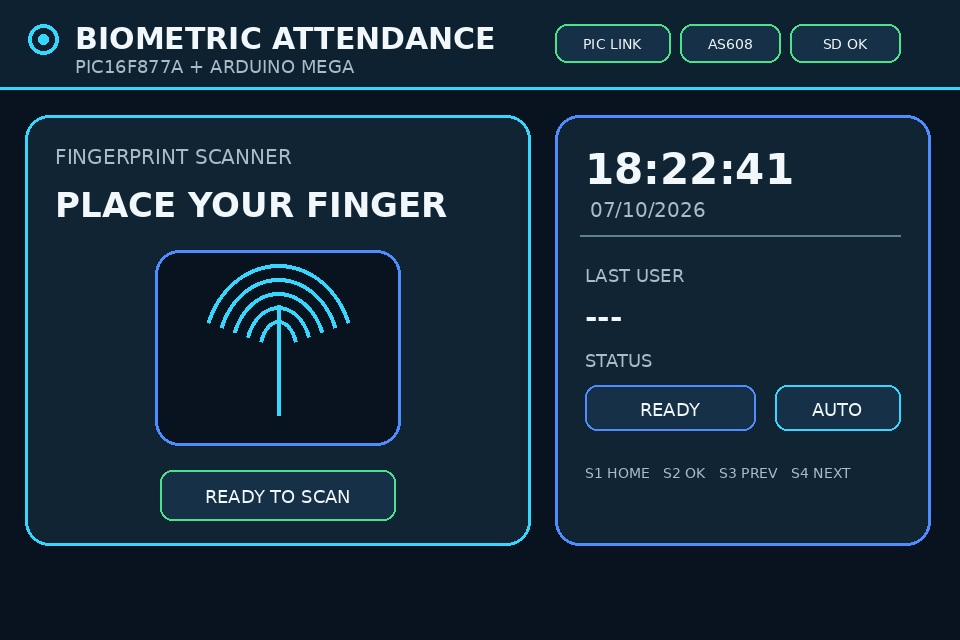
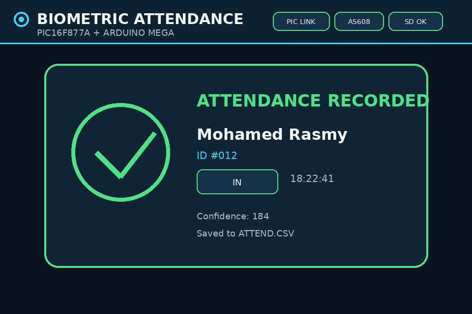
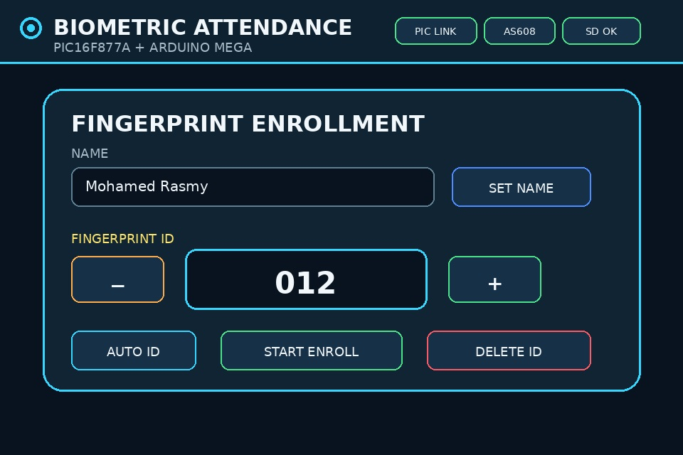
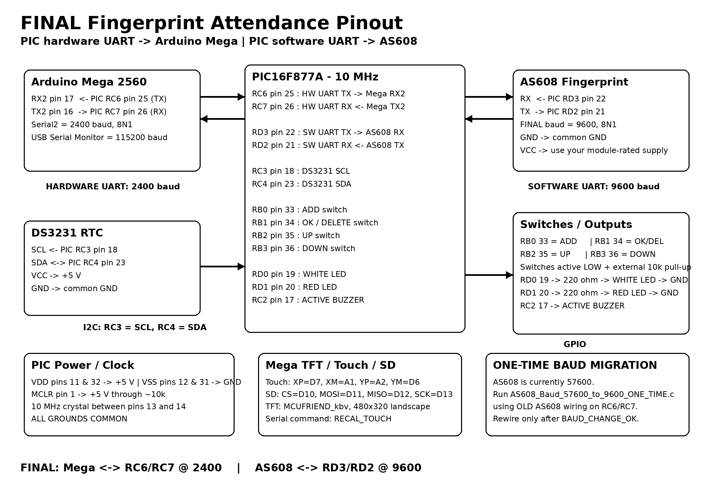

# Fingerprint Attendance System

A complete **biometric attendance system** combining an **AS608 fingerprint sensor**, **PIC16F877A**, **Arduino Mega 2560**, **3.5-inch TFT**, **DS3231 RTC**, **SD-card logging**, LEDs, buzzer, and physical controls.

This repository preserves **two separate hardware/firmware architectures** so the AS608 can be handled either by the PIC or directly by the Arduino Mega.

## System Preview

<p align="center">
  
  
  
</p>

## Architecture A - AS608 via PIC16F877A

```text
AS608 -> PIC16F877A -> Arduino Mega 2560 -> TFT / SD / UI
```

The PIC communicates directly with the AS608. The Mega handles the graphical interface, employee database, attendance logic, and SD logging.

Firmware: `firmware/variant-a-as608-via-pic/`

## Architecture B - AS608 Direct to Arduino Mega

```text
AS608 -> Arduino Mega 2560 -> TFT / SD / UI
                     ^
                     |
              PIC16F877A
         RTC / buttons / LEDs / buzzer
```

The AS608 connects directly to the Mega, while the PIC operates as a peripheral controller.

Firmware: `firmware/variant-b-as608-direct-mega/`

> These are alternative architectures. Do **not** mix firmware between them.

## Hardware Pinout Reference

<p align="center">
  
</p>

## Critical PIC16F877A Requirement

> **MCLR/RESET physical pin 1 must be pulled up to +5 V through a 10 kOhm resistor. Never leave MCLR floating.**

Also verify VDD pins 11/32, VSS pins 12/31, the required crystal, and a common ground between all modules.

## Main Features

- Fingerprint enrollment and identification
- IN / OUT / AUTO attendance modes
- TFT graphical interface
- DS3231 RTC
- SD-card CSV logging
- Employee record handling
- LED and buzzer feedback
- Diagnostic sketches
- Python CSV extraction utility

## Repository Structure

```text
fingerprint-attendance-system/
├── firmware/
│   ├── variant-a-as608-via-pic/
│   └── variant-b-as608-direct-mega/
├── hardware/
├── diagnostics/
├── assets/ui/
├── tools/
└── examples/
```

## Privacy

The example CSV contains fictional demonstration records only. Do not publish real attendance records or personal information.

## Skills Demonstrated

Embedded C, Arduino C++, UART, biometric sensing, TFT UI, RTC integration, SD logging, multi-controller design, and hardware debugging.

---

**Author:** Mohamed Rasmy  
**Project type:** Embedded / Biometric Attendance System
